# MASTER TECHNICAL BLUEPRINT
## Generative AI · Full-Stack Development · Python Engineering
### Integrated Ecosystem Architecture Reference Manual

---

**Document Version:** 1.0.0  
**Classification:** Technical Engineering Reference  
**Domain:** Generative AI × Software Engineering  
**Last Updated:** June 2026

---

# Table of Contents

1. [System Overview](#1-system-overview)
2. [Creative Module: AI Generation Pipelines](#2-creative-module-ai-generation-pipelines)
   - 2.1 [Image Generation Pipeline](#21-image-generation-pipeline)
   - 2.2 [Video Generation Pipeline](#22-video-generation-pipeline)
   - 2.3 [Audio Generation Pipeline](#23-audio-generation-pipeline)
   - 2.4 [Prompt Engineering Framework](#24-prompt-engineering-framework)
   - 2.5 [Model Comparison Matrix](#25-model-comparison-matrix)
3. [Engineering Module: Software Architecture](#3-engineering-module-software-architecture)
   - 3.1 [Python Application Architecture (Clean Architecture)](#31-python-application-architecture)
   - 3.2 [Web/React Frontend Architecture](#32-web-react-frontend-architecture)
   - 3.3 [AI Strategy Framework (Minimax, Heuristic, Weighted Random)](#33-ai-strategy-framework)
   - 3.4 [Procedural Audio Synthesis Engine](#34-procedural-audio-synthesis-engine)
   - 3.5 [Persistence & State Management](#35-persistence--state-management)
   - 3.6 [Replay System & Analytics Engine](#36-replay-system--analytics-engine)
   - 3.7 [Theme Engine & UI Component Framework](#37-theme-engine--ui-component-framework)
4. [Synthesis Module: AI-to-Application Integration](#4-synthesis-module-ai-to-application-integration)
   - 4.1 [Asset Pipeline (AI Output → Application Asset)](#41-asset-pipeline)
   - 4.2 [Data Flow Architecture](#42-data-flow-architecture)
   - 4.3 [API Integration Patterns](#43-api-integration-patterns)
5. [Project Deep Dives](#5-project-deep-dives)
   - 5.1 [Hayah Charity Application (Clean Architecture PyQt6)](#51-hayah-charity-application)
   - 5.2 [Vexon / Nexus TTT (AI Game System)](#52-vexon--nexus-ttt)
6. [System Flow Diagrams (Mermaid.js)](#6-system-flow-diagrams)
7. [Performance & Benchmarking](#7-performance--benchmarking)
8. [Appendices](#8-appendices)

---

# 1. System Overview

## 1.1 Course Ecosystem Architecture

The following diagram illustrates the high-level integration of all course modules:

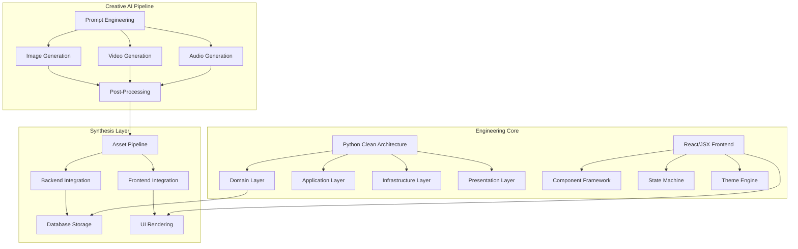

## 1.2 Technology Stack Matrix

| Layer | Technology | Version | Purpose |
|-------|-----------|---------|---------|
| **Desktop GUI** | PyQt6 / Tkinter | 6.x / Built-in | Rich desktop application framework |
| **Web Frontend** | React (JSX) | 18.x | SPA with useReducer state management |
| **Backend Logic** | Python 3.11+ | 3.11–3.14 | Core engine, AI strategies, business logic |
| **Database** | SQLite (WAL mode) | 3.x | Persistent storage with migration support |
| **AI - Images** | Qwen, Leonardo AI, Gemini 2.0/2.5 Flash, Ideogram, Playground | N/A | Multi-model image generation |
| **AI - Video** | Motion2Fast, Photorealistic Keyframes | N/A | AI video synthesis |
| **AI - Audio** | ElevenLabs-style TTS, Procedural WAV synthesis | N/A | Speech + music generation |
| **Auth** | PBKDF2 (SHA-256) | N/A | Password hashing |
| **Charts** | Matplotlib | 3.x | Data visualization |
| **Export** | ReportLab, CSV, JSON | N/A | Document generation |

---

# 2. Creative Module: AI Generation Pipelines

## 2.1 Image Generation Pipeline

### 2.1.1 Workflow Architecture

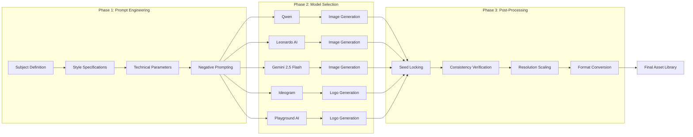

### 2.1.2 Prompt Engineering Strategy (Character Consistency)

The project demonstrates a **seed-locked constrained prompt** approach for maintaining character identity across 20+ scene variations.

**Constrained Prompt Template:**

```text
Ultra realistic photo of the same man, 25 years old, mixed ethnicity,
oval slightly full face, almond-shaped deep black eyes, straight nose,
full lips with a subtle natural smile, light soft stubble beard,
medium-length black slightly wavy messy hair, smooth flawless youthful
skin with natural texture, athletic body, relaxed posture, calm mysterious
personality, highly detailed, 85mm lens, depth of field, cinematic
photography, photorealistic, consistent face identity
```

**Negative Prompt:**

```text
different face, distorted face, ugly, bad anatomy, extra fingers, blurry,
low quality, unrealistic skin, cartoon, anime, overexposed, underexposed
```

**Seed Parameter:**

```text
const seed: 906380461
```

### 2.1.3 Scene Variation Matrix (TASK 2)

The character is placed into 20 distinct environmental contexts:

| # | Scene Context | Lighting | Mood | Camera Technique |
|---|--------------|----------|------|------------------|
| 1 | Cozy coffee shop | Warm lighting | Candid | Shallow DoF |
| 2 | Modern workspace | Soft daylight | Professional | Eye-level |
| 3 | City street | Natural light | Casual | Street photography |
| 4 | Bookstore | Soft shadows | Calm | Medium shot |
| 5 | Minimalist apartment | Morning sunlight | Intimate | Wide angle |
| 6 | City street at night | Neon lights | Cinematic | Low angle |
| 7 | Luxury car | Urban background | Confident | Three-quarter |
| 8 | Crossing street | Motion blur | Dynamic | Panning shot |
| 9 | Graffiti wall | Street style | Edgy | Close-up |
| 10 | Rooftop | Sunset | Serene | Silhouette |
| 11 | Beach | Soft golden light | Romantic | Golden hour |
| 12 | Forest | Natural green tones | Peaceful | Environmental |
| 13 | Mountain | Dramatic lighting | Epic | Wide establishing |
| 14 | Park grass | Relaxed mood | Casual | Eye-level |
| 15 | Lake | Reflection | Calm | Symmetrical |
| 16 | Modern office | Confident posture | Professional | Corporate |
| 17 | Rooftop 2 | City skyline backdrop | Urban establishing | Wide |
| 18 | Outdoor cafe | Lifestyle shot | Candid | Street photography |
| 19 | Shopping district | Casual walk | Lifestyle | Full body |
| 20 | Airport terminal | Travel mood | Cinematic | Environmental |

### 2.1.4 Technical Parameters by Model

| Parameter | Qwen | Leonardo AI | Gemini 2.5 Flash | Ideogram | Playground |
|-----------|------|-------------|-------------------|----------|------------|
| **Resolution** | 1024×1024 | 1024×1024 | 1536×1536 | 1024×1024 | 1024×1024 |
| **Style** | Photorealistic | Cinematic | Ultra-realistic | Vector/Logo | Vector/Logo |
| **Seed Control** | Yes | Yes | Limited | Yes | Yes |
| **Aspect Ratio** | 1:1 | 1:1, 16:9 | 1:1, 4:3, 16:9 | 1:1 | 1:1 |
| **Iterations** | 1–4 | 4–8 | 1 | 4 | 4 |
| **Negative Prompt** | Supported | Supported | Supported | Partial | Supported |

### 2.1.5 Logo Generation Parameters (S5, S7)

Custom vector-style logo generation using specific design constraints:

```text
a minimalist vector logo design featuring [subject], clean lines,
geometric shapes, professional, scalable vector graphics,
monochromatic with strategic accent color, white background,
corporate identity, brand-ready, no text
```

**Tools Used:**
- **Ideogram**: 4 logo variations per prompt, precise text rendering
- **Playground AI**: Custom style mixing, vector output approximation

---

## 2.2 Video Generation Pipeline

### 2.2.1 Workflow Architecture

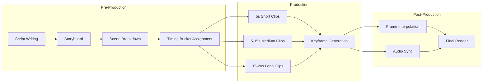

### 2.2.2 Video Timing Buckets (TASK 3.1)

| Bucket | Duration | Frame Count (30fps) | Content Type | Tools |
|--------|----------|---------------------|--------------|-------|
| **Short** | 5s | 150 frames | Single scene, minimal motion | Photorealistic Keyframes |
| **Medium** | 5–15s | 150–450 frames | Scene transition, narrative | motion2Fast |
| **Long** | 15–20s | 450–600 frames | Multi-scene, complex narrative | Motion2Fast + Compositing |

### 2.2.3 Keyframe Video Generation

**Prompt Structure for Video:**

```text
Photorealistic_Keyframes_A_woman_with_curly_dark_hair_wearing_a_denim...
```

Generated MP4 output with embedded keyframe interpolation.

### 2.2.4 Cinematic Beverage Commercial (S6)

**Tools Used:**
- **Motion2Fast**: Ultra-cinematic beverage commercial video
- **Gemini 2.0 Image**: Vibrant red strawberry soda bottle with fresh strawberries exploding
- **Gemini 2.5 Flash Image**: Same subject with enhanced photorealism

**Prompt Architecture:**

```text
Ultra cinematic beverage commercial video of a vibrant [product],
dynamic motion, slow motion liquid splash, dramatic lighting,
professional product photography, 4K, shallow depth of field,
rich colors, premium brand aesthetic, smooth slow motion
```

### 2.2.5 Technical Specifications

| Parameter | Motion2Fast | Photorealistic Keyframes |
|-----------|------------|--------------------------|
| **Resolution** | 1080p | 1080p |
| **Frame Rate** | 30 fps | 24–30 fps |
| **Length** | Up to 20s | Up to 10s |
| **Style Control** | Text prompt | Text + Image keyframes |
| **Motion Control** | Motion strength parameter | Keyframe timing |
| **Output Format** | MP4 (H.264) | MP4 + ZIP (frames) |

---

## 2.3 Audio Generation Pipeline

### 2.3.1 Workflow Architecture

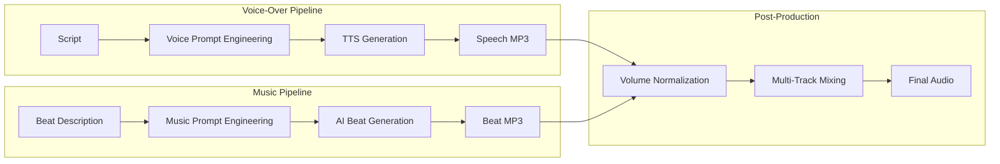

### 2.3.2 Speech Generation Prompts

Two distinct voice-over tracks generated:

**Track 1 - "Syrian Dawn Rising":**

```text
[Voice-over script for Syrian-themed content]
- Warm, resonant male voice
- Slow, deliberate pace
- Emotional yet professional tone
- Background: subtle ambient drone
```

**Track 2 - "Syrian Dawn Rising 2":**

```text
[Alternative take]
- Slightly faster pace
- More energetic delivery
- Same voice profile for consistency
```

### 2.3.3 Beat/Music Generation

**Beat 1:**

```text
[Prompt for beat generation]
- Cinematic orchestral hybrid
- Building tension with percussion
- Middle Eastern-inspired melodic elements
- 85–90 BPM
- Minor key (D minor)
```

**Beat 2:**

```text
[Alternative beat track]
- More electronic/ambient
- Atmospheric pads
- Subtle rhythmic pulse
- Same BPM range
```

### 2.3.4 Procedural Sound Synthesis (Engineering Counterpart)

In the engineering module, sound is generated **procedurally** using ADSR envelope synthesis:

```python
# Vexon sound synthesis engine (vexon.py:916-1041)
def _make_wav(samples: list[float]) -> bytes:
    """Pack float samples into 16-bit mono WAV."""
    n = len(samples)
    data = struct.pack(
        f'<{n}h',
        *(max(-32767, min(32767, int(s * 32767))) for s in samples),
    )
    header = struct.pack(
        '<4sI4s4sIHHIIHH4sI',
        b'RIFF', 36 + len(data), b'WAVE',
        b'fmt ', 16, 1, 1, _SR, _SR * 2, 2, 16, b'data', len(data),
    )
    return header + data
```

The synthesis engine supports four waveform types:

| Waveform | Function | Use Case |
|----------|----------|----------|
| `sine` | `sin(2π * phase)` | Win fanfares, theme changes |
| `triangle` | `2·|2·frac - 1| - 1` | Move sounds, undo chirps |
| `square` | `1 if frac < 0.5 else -1` | Alert sounds |
| `sawtooth` | `2·frac - 1` | Draw/neutral sounds |

---

## 2.4 Prompt Engineering Framework

### 2.4.1 Five-Prompt Methodology (S2)

The course establishes a structured prompt taxonomy:

| # | Prompt Type | Purpose | Engineering Application |
|---|-------------|---------|------------------------|
| 1 | `برنامج دوام` (Attendance Program) | Generate working software from spec | Code generation |
| 2 | `شرح كود برمجي` (Code Explanation) | Document existing code | Documentation generation |
| 3 | `اختبار مؤتمت` (Automated Test) | Generate test suites | Test generation |
| 4 | `شرح تفاصيل البرمجة الغرضية` (OOP Explanation) | Educational content | Knowledge extraction |
| 5 | `الطريقة المثلى لبدء برومت` (Optimal Prompt Start) | Meta-prompting | Prompt pattern documentation |

### 2.4.2 Prompt Structural Template

```
[Role/Actor Definition] → [Task Specification] → [Constraints] → [Output Format]
```

**Example from Code Generation:**

```text
Role: You are a senior Python developer
Task: Create an attendance tracking program with the following features...
Constraints: Use Clean Architecture, PyQt6, SQLite
Output: Full working code with documentation
```

---

## 2.5 Model Comparison Matrix

### 2.5.1 Image Generation Models

| Criterion | Qwen | Leonardo AI | Gemini 2.5 Flash | Ideogram | Playground |
|-----------|------|-------------|-------------------|----------|------------|
| **Photorealism** | 8/10 | 9/10 | 9.5/10 | 7/10 | 7/10 |
| **Consistency** | 7/10 | 8/10 | 9/10 | 6/10 | 6/10 |
| **Speed** | Fast | Medium | Fast | Medium | Fast |
| **Prompt Adherence** | 8/10 | 9/10 | 9/10 | 8/10 | 7/10 |
| **Cost** | Free/API | Credits | API | Credits | Free |
| **Best For** | General | Cinematic | Ultra-real | Logos/Typography | Artistic exploration |

### 2.5.2 Video Generation Models

| Criterion | Motion2Fast | Photorealistic Keyframes |
|-----------|------------|--------------------------|
| **Motion Quality** | 8/10 | 7/10 |
| **Scene Complexity** | High | Medium |
| **Temporal Consistency** | 8/10 | 6/10 |
| **Control Precision** | Medium | High (keyframe-based) |
| **Max Duration** | 20s | 10s |
| **Post-Processing Need** | Minimal | Frame interpolation required |

### 2.5.3 Audio Synthesis Comparison

| Criterion | AI TTS (ElevenLabs-style) | Procedural WAV (PyQt6) |
|-----------|--------------------------|------------------------|
| **Realism** | 9/10 | 5/10 (synthetic) |
| **Latency** | 500ms–2s | Instant (<1ms) |
| **Control** | Voice selection, speed | Frequency, envelope, waveform |
| **Use Case** | Voice-overs, narration | UI feedback, game sounds |
| **File Size** | 50–500 KB | <10 KB per sound |

---

# 3. Engineering Module: Software Architecture

## 3.1 Python Application Architecture (Clean Architecture)

### 3.1.1 Layer Architecture

The course implements **Clean Architecture** (a variant of Onion/Hexagonal Architecture) with four distinct layers:

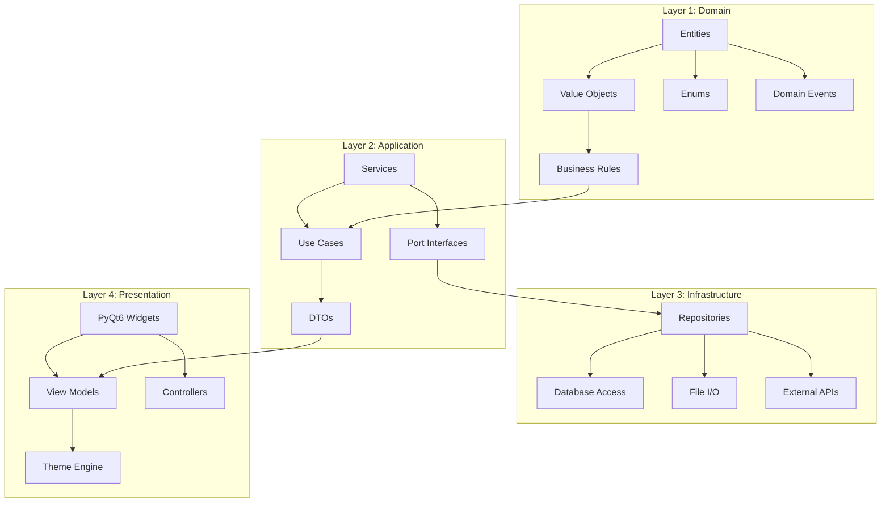

### 3.1.2 Dependency Rule

All dependencies point **inward**. Outer layers depend on inner layers, never the reverse:

```
Presentation → Application → Domain
    ↓                              ↑
    └────── Infrastructure ────────┘
```

### 3.1.3 Concrete Implementation: Hayah Application (TASK 1)

**Directory Structure:**

```
hayah/
├── main.py                              ← DI Composition Root
├── domain/                             ← Layer 1: Zero external dependencies
│   ├── user.py                         ← User aggregate root
│   ├── charity.py                      ← CharityEntry + TimeCategory
│   ├── goal.py                         ← Goal + GoalPeriod enum
│   └── achievement.py                  ← Achievement + 12 milestones
├── application/                        ← Layer 2: Business orchestration
│   ├── auth_service.py                 ← PBKDF2 registration/login
│   ├── charity_service.py              ← Donation CRUD
│   ├── statistics_service.py           ← Analytics & trends
│   ├── goal_service.py                 ← Goal evaluation
│   └── achievement_service.py          ← Gamification engine
├── infrastructure/                     ← Layer 3: Persistence & I/O
│   ├── database.py                     ← SQLite + WAL + migrations
│   ├── user_repository.py              ← User persistence
│   ├── charity_repository.py           ← Data access
│   ├── backup_manager.py               ← Backup with manifests
│   └── export_service.py               ← CSV/JSON/PDF export
└── ui/                                 ← Layer 4: PyQt6 presentation
    ├── login_screen.py                 ← Auth window
    ├── main_window.py                  ← QStackedWidget router
    ├── views/                          ← Screen views
    ├── widgets/                        ← Reusable components
    ├── controllers/                    ← UI↔Service bridge
    └── utils/                          ← Constants, formatters
```

**Domain Entity Example (`domain/user.py`):**

```python
class User:
    def __init__(self, id: str, name: str, email: str, password_hash: str):
        self.id = id
        self.name = name
        self.email = email
        self.password_hash = password_hash
        self.created_at = time.time()
```

### 3.1.4 Application Service Example (`application/auth_service.py`)

The authentication service uses **PBKDF2** with SHA-256 for password hashing:

```python
import hashlib
import os

class AuthService:
    @staticmethod
    def hash_password(password: str) -> str:
        salt = os.urandom(32)
        key = hashlib.pbkdf2_hmac(
            'sha256', password.encode('utf-8'), salt, 100000
        )
        return salt + key  # Stored as binary

    @staticmethod
    def verify_password(password: str, stored: bytes) -> bool:
        salt = stored[:32]
        key = stored[32:]
        new_key = hashlib.pbkdf2_hmac(
            'sha256', password.encode('utf-8'), salt, 100000
        )
        return key == new_key
```

### 3.1.5 Database Configuration (`infrastructure/database.py`)

Uses **SQLite with WAL mode** for concurrent access:

```python
import sqlite3

def get_connection(db_path: str) -> sqlite3.Connection:
    conn = sqlite3.connect(db_path)
    conn.execute("PRAGMA journal_mode=WAL;")
    conn.execute("PRAGMA foreign_keys=ON;")
    conn.row_factory = sqlite3.Row
    return conn
```

---

## 3.2 Web/React Frontend Architecture

### 3.2.1 Component Architecture (NexusTTT.jsx)

The React frontend follows a **functional component + useReducer** pattern across 16 architectural sections:

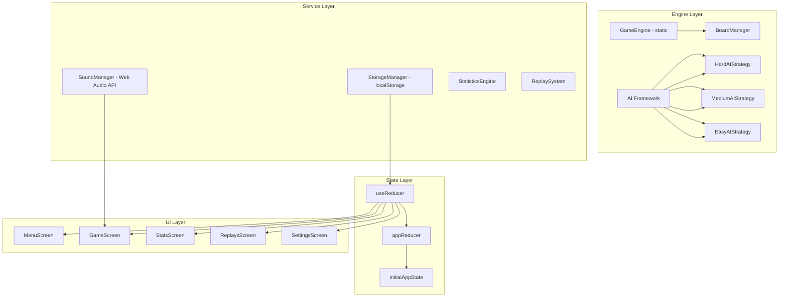

### 3.2.2 State Machine (useReducer)

The application uses a **pure reducer** pattern for all state mutations:

```javascript
function appReducer(state, action) {
  switch (action.type) {
    case "NAVIGATE":
      return { ...state, screen: action.screen };
    case "MAKE_MOVE": {
      const newBoard = GameEngine.applyMove(state.board, action.index, action.player);
      const { status, winner, winPattern } = GameEngine.evaluateBoard(newBoard);
      return {
        ...state,
        board: newBoard,
        currentPlayer: GameEngine.getOpponent(action.player),
        gameStatus: status,
        winner, winPattern,
        moveCount: state.moveCount + 1,
        moveHistory: [...state.moveHistory, { player: action.player, index: action.index }],
      };
    }
    case "UNDO_MOVE": {
      const steps = (state.gameMode === "vs-ai" && histLen >= 2) ? 2 : 1;
      const newHistory = state.moveHistory.slice(0, -steps);
      const newBoard = buildBoardFromHistory(newHistory);
      return { ...state, board: newBoard, moveHistory: newHistory, gameStatus: "playing" };
    }
    // ... 12 more action types
  }
}
```

**Action Types:**

| Action | Trigger | Side Effects |
|--------|---------|--------------|
| `NAVIGATE` | Menu/Header clicks | None |
| `MAKE_MOVE` | Cell click, AI response | Sound, Replay recording |
| `UNDO_MOVE` | Undo button | Sound |
| `AI_THINKING` | AI computation start/end | Visual indicator |
| `GAME_START` | New game button | Reset board, start replay |
| `SET_THEME` | Theme selection | CSS variable injection |
| `UPDATE_STATISTICS` | Game end | Debounced localStorage save |

### 3.2.3 AI Controller (Async Computation)

AI runs **asynchronously** with deliberate UX delay:

```javascript
class AIController {
  computeMove(board, player, difficulty) {
    const strategy = this._strategies[difficulty];
    const delay = APP_CONFIG.aiThinkingDelayMs[difficulty] ?? 600;

    return new Promise((resolve) => {
      setTimeout(() => {
        const move = safeExecute(
          () => strategy.getBestMove(board, player),
          GameEngine.getEmptyCells(board)[0] ?? -1,
          ErrorCodes.AI_COMPUTE, LOG.ai
        );
        resolve(move);
      }, delay);
    });
  }
}
```

**Thinking Delays:**

| Difficulty | Delay (ms) | UX Rationale |
|------------|-----------|--------------|
| Easy | 500 | Quick response, casual feel |
| Medium | 750 | Noticeable deliberation |
| Hard | 1100 | Feels like deep calculation |

---

## 3.3 AI Strategy Framework

### 3.3.1 Strategy Pattern Implementation

The AI system uses the **Strategy pattern** with three concrete implementations:

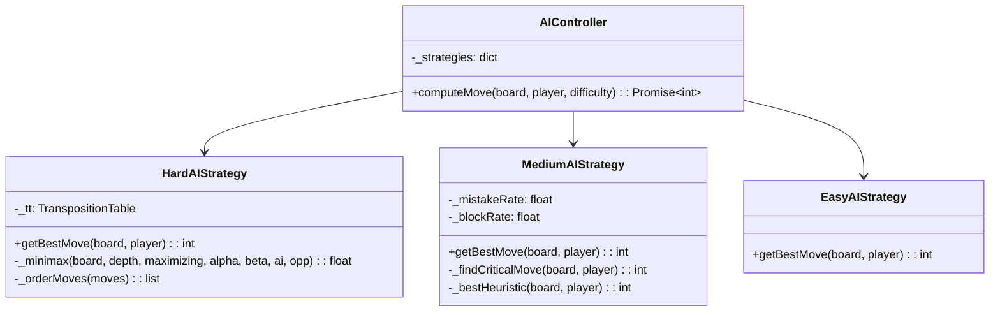

### 3.3.2 Hard AI: Minimax with Alpha-Beta Pruning

**Algorithm Complexity:** O(b^d · αβ) where αβ pruning reduces effective branching factor to ~√b.

```python
class HardAIStrategy:
    def get_best_move(self, board, ai_player, cfg):
        self._tt.reset()
        depth_limit = ai_depth_limit(cfg.size)
        opponent = ai_player.opponent()
        best_score = -math.inf
        best_move = -1

        for idx in _priority_order(GameEngine.empty_cells(board), cfg.size):
            nxt = GameEngine.apply_move(board, idx, ai_player, cfg)
            score = self._minimax(nxt, 0, False, -math.inf, math.inf,
                                  ai_player, opponent, cfg, depth_limit)
            if score > best_score:
                best_score = score
                best_move = idx
        return best_move

    def _minimax(self, board, depth, maximizing, alpha, beta,
                 ai_player, opponent, cfg, depth_limit):
        tt_key = self._tt.make_key(board, maximizing)
        cached = self._tt.get(tt_key)
        if cached is not None:
            return cached

        result = GameEngine.evaluate_board(board, cfg)

        if result.status == "win":
            score = (depth_limit - depth + 1) * 100.0
            val = score if result.winner is ai_player else -score
            self._tt.set(tt_key, val)
            return val

        if result.status == "draw":
            self._tt.set(tt_key, 0.0)
            return 0.0

        if depth >= depth_limit:
            h = GameEngine.heuristic_score(board, ai_player, cfg)
            self._tt.set(tt_key, h)
            return h

        # α-β search with move ordering
        empties = _priority_order(GameEngine.empty_cells(board), cfg.size)
        current = ai_player if maximizing else opponent
        # ... alpha-beta loop with pruning
```

### 3.3.3 Transposition Table (Memoization)

```python
class TranspositionTable:
    def make_key(self, board, maximizing):
        return tuple(v.value for v in board) + (maximizing,)

    def get(self, key):
        v = self._table.get(key)
        if v is not None:
            self._hits += 1
        else:
            self._misses += 1
        return v

    def diagnostics(self):
        total = self._hits + self._misses
        rate = f"{100 * self._hits / total:.1f}%" if total else "n/a"
        return {"size": len(self._table), "hits": self._hits,
                "misses": self._misses, "hit_rate": rate}
```

### 3.3.4 Move Ordering Heuristic

```python
def _priority_order(cells, size):
    cx = cy = size / 2 - 0.5
    def dist(i):
        r, c = divmod(i, size)
        return math.hypot(r - cx, c - cy)
    return sorted(cells, key=dist)
```

**Priority Sequence:** Center → Corners → Edges (for optimal α-β pruning)

### 3.3.5 Medium AI: Heuristic + Mistake Injection

```python
class MediumAIStrategy:
    def get_best_move(self, board, ai_player, cfg):
        opp = ai_player.opponent()
        mistake_rate = max(0.10, 0.28 - 0.02 * cfg.size)
        block_rate = 0.86

        # 1. Win immediately
        win = self._find_critical_move(board, ai_player, cfg)
        if win != -1:
            return win
        # 2. Block opponent win (86% chance)
        block = self._find_critical_move(board, opp, cfg)
        if block != -1 and random.random() < block_rate:
            return block
        # 3. Probabilistic mistake
        if random.random() < mistake_rate:
            return random.choice(GameEngine.empty_cells(board))
        # 4. Heuristic-best move
        return self._best_heuristic(board, ai_player, cfg)
```

### 3.3.6 Heuristic Scoring

```python
class GameEngine:
    @staticmethod
    def heuristic_score(board, player, cfg):
        opp = player.opponent()
        p_runs = GameEngine.count_open_runs(board, player, cfg)
        o_runs = GameEngine.count_open_runs(board, opp, cfg)
        score = 0.0
        for k in range(1, wl):
            w = 10 ** (k - 1)  # Exponential weighting
            score += p_runs.get(k, 0) * w
            score -= o_runs.get(k, 0) * w * 1.1  # Defensive bias
        # Center proximity bonus
        cx = cy = cfg.size / 2
        for i, v in enumerate(board):
            r, c = divmod(i, cfg.size)
            dist = math.hypot(r - cx + 0.5, c - cy + 0.5)
            bonus = max(0.0, (cx - dist)) * 0.3
            if v is player: score += bonus
            elif v is opp:  score -= bonus
        return score
```

### 3.3.7 Dynamic Difficulty Calibration

```python
def ai_depth_limit(size: int) -> int:
    """Return minimax search depth for board size to stay performant."""
    table = {3: 10, 4: 6, 5: 4, 6: 3, 7: 2, 8: 2, 9: 2, 10: 2}
    return table.get(size, 2)

def win_length_for(size: int) -> int:
    """Return required consecutive marks to win for a given board size."""
    table = {3: 3, 4: 4, 5: 4, 6: 5, 7: 5, 8: 5, 9: 5, 10: 5}
    return table.get(size, min(size, 5))
```

| Board Size | Win Length | AI Depth | Complexity |
|------------|-----------|----------|------------|
| 3×3 | 3 | 10 (full) | 9! = 362,880 |
| 4×4 | 4 | 6 | ~16^6 = 16M |
| 5×5 | 4 | 4 | ~25^4 = 390K |
| 6×6 | 5 | 3 | ~36^3 = 46K |
| 7×7 | 5 | 2 | ~49^2 = 2.4K |
| 8×8 | 5 | 2 | ~64^2 = 4K |
| 9×9 | 5 | 2 | ~81^2 = 6.5K |
| 10×10 | 5 | 2 | ~100^2 = 10K |

---

## 3.4 Procedural Audio Synthesis Engine

### 3.4.1 ADSR Envelope Generation

The Vexon sound manager synthesizes all game audio procedurally at startup:

```python
def _adsr(freq, dur, *, sr=44100, attack=0.012, decay=0.055,
          sustain=0.62, release=0.09, wave="sine", vol=0.72):
    n = int(dur * sr)
    a_n = max(1, int(attack * sr))
    d_n = max(1, int(decay * sr))
    r_n = max(1, int(release * sr))
    s_n = max(0, n - a_n - d_n - r_n)
    out = []

    for i in range(n):
        t = i / sr
        phase = freq * t
        frac = phase - math.floor(phase)

        # Waveform generation
        if wave == "sine":      s = math.sin(2.0 * math.pi * phase)
        elif wave == "triangle":s = 2.0 * abs(2.0 * frac - 1.0) - 1.0
        elif wave == "square":  s = 1.0 if frac < 0.5 else -1.0

        # ADSR envelope
        if i < a_n:
            env = i / a_n
        elif i < a_n + d_n:
            env = 1.0 - (1.0 - sustain) * (i - a_n) / d_n
        elif i < a_n + d_n + s_n:
            env = sustain
        else:
            ri = i - a_n - d_n - s_n
            env = sustain * max(0.0, 1.0 - ri / r_n) if r_n else 0.0

        out.append(s * env * vol)
    return out
```

### 3.4.2 Sound Effect Catalogue

| Sound | Freq (Hz) | Duration | Waveform | Attack | Decay | Sustain | Release | Volume |
|-------|-----------|----------|----------|--------|-------|---------|---------|--------|
| move_x | 466.16 | 0.16s | triangle | 0.005 | 0.04 | 0.5 | 0.07 | 0.55 |
| move_o | 349.23 | 0.16s | triangle | 0.005 | 0.04 | 0.5 | 0.07 | 0.55 |
| ai_move | 392.00 | 0.13s | sine | 0.008 | 0.05 | 0.45 | 0.06 | 0.45 |
| win | 523→659→784→1047 | 4-note seq | sine | 0.01 | - | - | 0.12 | 0.60–0.68 |
| draw | 392→370→349 | 3-note seq | sine | 0.01 | - | - | 0.10 | 0.45–0.50 |
| loss | 349→294 | 2-note seq | sine | 0.01 | - | - | 0.12 | 0.40–0.45 |
| undo | 280 | 0.18s | triangle | 0.005 | 0.08 | 0.40 | 0.06 | 0.42 |
| reset | 392→523 | 2-note seq | sine | 0.01 | - | - | 0.08 | 0.48–0.52 |
| hover | 680 | 0.04s | sine | 0.003 | 0.02 | 0.2 | 0.01 | 0.12 |
| theme | 800 | 0.10s | sine | 0.005 | 0.04 | 0.3 | 0.04 | 0.28 |

### 3.4.3 Web Audio API Equivalent (NexusTTT.jsx)

```javascript
_tone({ frequency = 440, type = "sine", duration = 0.15,
        gain = 0.3, attack = 0.01, decay = 0.05,
        sustain = 0.6, release = 0.06 } = {}) {
  if (!this._ensureActive()) return;
  const ctx = this._ctx;
  const osc = ctx.createOscillator();
  const gainNode = ctx.createGain();
  osc.connect(gainNode);
  gainNode.connect(ctx.destination);
  osc.type = type;
  osc.frequency.setValueAtTime(frequency, ctx.currentTime);
  const v = this._volume * gain;
  gainNode.gain.setValueAtTime(0, ctx.currentTime);
  gainNode.gain.linearRampToValueAtTime(v, ctx.currentTime + attack);
  gainNode.gain.linearRampToValueAtTime(v * sustain, ctx.currentTime + attack + decay);
  gainNode.gain.linearRampToValueAtTime(0, ctx.currentTime + duration - release);
  osc.start(ctx.currentTime);
  osc.stop(ctx.currentTime + duration);
}
```

---

## 3.5 Persistence & State Management

### 3.5.1 Versioned JSON Schema

```python
@dataclass
class StoredData:
    schema_version: int = SCHEMA_VERSION  # v3
    settings:       AppSettings = field(default_factory=AppSettings)
    statistics:     StatisticsData = field(default_factory=StatisticsData)
    game_records:   list[dict] = field(default_factory=list)
    replays:        list[dict] = field(default_factory=list)
    profiles:       dict[str, dict] = field(default_factory=dict)
    saved_at:       float = field(default_factory=time.time)
```

### 3.5.2 Backup & Recovery Strategy

```python
class PersistenceManager:
    def load(self) -> StoredData:
        """Fall-back chain: primary → backup → fresh defaults."""
        raw = _try_load(DATA_FILE)
        if raw is None:
            raw = _try_load(BKUP_FILE)
        if raw is None:
            return StoredData()
        return self._migrate(raw)

    def save(self, data: StoredData) -> bool:
        """Atomic save with backup before overwrite."""
        if DATA_FILE.exists():
            shutil.copy2(DATA_FILE, BKUP_FILE)
        data.saved_at = time.time()
        payload = _to_dict(data)
        with open(DATA_FILE, "w", encoding="utf-8") as f:
            json.dump(payload, f, indent=2)
```

### 3.5.3 React localStorage Equivalent

```javascript
class StorageManager {
  load() {
    const raw = localStorage.getItem(this._key);
    if (!raw) return StorageManager.defaultData();
    try { return this._migrate(JSON.parse(raw)); }
    catch (e) {
      const backup = localStorage.getItem(this._backup);
      if (backup) return this._migrate(JSON.parse(backup));
      throw new AppError(ErrorCodes.STORAGE_CORRUPT, "Both primary and backup corrupt");
    }
  }

  save(data) {
    const current = localStorage.getItem(this._key);
    if (current) localStorage.setItem(this._backup, current);  // Backup
    localStorage.setItem(this._key, JSON.stringify(payload));
  }
}
```

### 3.5.4 Debounced Auto-Save (React)

```javascript
useEffect(() => {
  const timer = setTimeout(() => {
    storageManager.save({
      statistics: state.statistics,
      replays: state.replays,
      settings: { theme, difficulty, gameMode, soundEnabled, volume, playerNames },
    });
  }, 600);  // 600ms debounce
  return () => clearTimeout(timer);
}, [state.statistics, state.replays, state.theme, state.difficulty,
    state.gameMode, state.soundEnabled, state.volume]);
```

---

## 3.6 Replay System & Analytics Engine

### 3.6.1 Replay Data Structure

```python
replay = {
    "id": str(uuid.uuid4()),
    "_board_size": cfg.size,
    "_difficulty": difficulty,
    "_game_mode": game_mode,
    "_user_id": user_id,
    "player_names": dict(player_names),
    "moves": [
        {"player": "X", "index": 4, "ts": 1712345678.0},
        {"player": "O", "index": 0, "ts": 1712345678.5},
        # ... frame sequence
    ],
    "start_time": time.time(),
    "end_time": None,
    "duration": 0.0,
    "result": {"winner": "X"},
    "_outcome": "win",
}
```

### 3.6.2 Frame-Accurate Board Reconstruction

```python
@staticmethod
def board_at_frame(replay, frame):
    """Reconstruct board state at a specific move frame (0 = empty)."""
    size = replay.get("_board_size") or replay.get("board_size", 3)
    cfg = BoardConfig.for_size(size)
    board = GameEngine.empty_board(cfg)

    for rec in replay.get("moves", [])[:frame]:
        p = Player(rec["player"])
        idx = int(rec["index"])
        if 0 <= idx < cfg.cell_count and board[idx] is Player.NONE:
            board[idx] = p
    return board
```

### 3.6.3 Statistics Engine Data Model

```python
@dataclass
class StatisticsData:
    total_games:         int = 0
    wins_x:              int = 0
    wins_o:              int = 0
    draws:               int = 0
    total_moves:         int = 0
    avg_moves:           float = 0.0
    streak_current:      int = 0
    streak_best:         int = 0
    loss_streak_current: int = 0
    loss_streak_best:    int = 0
    total_playtime_sec:  float = 0.0
    by_difficulty:       dict = field(default_factory=dict)
    by_board_size:       dict = field(default_factory=dict)
```

### 3.6.4 Per-Difficulty Breakdown Tracking

```python
# Populated via __post_init__
by_difficulty: {
    "easy":   {"wins": 0, "losses": 0, "draws": 0},
    "medium": {"wins": 0, "losses": 0, "draws": 0},
    "hard":   {"wins": 0, "losses": 0, "draws": 0},
}

# Per board size
by_board_size: {
    "3": {"wins_x": 0, "wins_o": 0, "draws": 0},
    "4": {"wins_x": 0, "wins_o": 0, "draws": 0},
    # ... up to 10
}
```

---

## 3.7 Theme Engine & UI Component Framework

### 3.7.1 Theme Architecture

Both the PyQt6 and React implementations use a **token-based theme system**:

```python
@dataclass
class ThemePalette:
    id:            str
    name:          str
    bg:            str         # Main background
    surface:       str         # Card/surface background
    surface_alt:   str         # Elevated surface
    border:        str         # Border color
    grid_line:     str         # Grid/separator lines
    accent:        str         # Primary accent
    accent_light:  str         # Hover accent
    text:          str         # Primary text
    text_muted:    str         # Secondary/muted text
    player_x:      str         # Player X color
    player_o:      str         # Player O color
    win_color:     str         # Win highlight
    cell_hover:    str         # Cell hover state
    danger:        str = "#f43f5e"  # Danger/destructive actions
```

### 3.7.2 Theme Palette Registry

| Theme | ID | Background | Accent | Mood |
|-------|-----|------------|--------|------|
| True Dark | `dark` | `#121212` | `#c9a84c` (gold) | Professional |
| Light Classic | `light` | `#f5f0e8` | `#7c4f2a` (brown) | Warm |
| Midnight Blue | `midnight` | `#0a0e1a` | `#3b82f6` (blue) | Focused |
| Emerald | `emerald` | `#0d1a12` | `#10b981` (green) | Natural |
| Royal Purple | `purple` | `#0e0816` | `#a855f7` (purple) | Luxurious |
| High Contrast | `hc` | `#000000` | `#ffff00` (yellow) | Accessibility |
| Minimal Mono | `mono` | `#18181b` | `#f4f4f5` (white) | Minimalist |
| Synthwave | `neon` | `#070012` | `#bf00ff` (neon) | Cyberpunk |

### 3.7.3 QSS Theme Injection (PyQt6)

```python
def build_qss(self) -> str:
    t = self._current
    return f"""
    QMainWindow {{
        background-color: {t.bg};
        color: {t.text};
    }}
    VexButton {{
        background: transparent;
        border: 1px solid {t.border};
        color: {t.text};
    }}
    VexButton:hover {{
        background: {t.surface_alt};
        border-color: {t.accent};
        color: {t.accent};
    }}
    VexButton[primary="true"] {{
        background: {t.accent};
        color: {t.bg};
    }}
    """
```

### 3.7.4 React CSS-in-JS Equivalent

```javascript
const THEMES = {
  dark: {
    bg: "#08080f", surface: "#10101c", surfaceAlt: "#18182a",
    border: "#252538", accent: "#c9a84c",
    text: "#e6e6f0", textMuted: "#66668a",
    playerX: "#5b8dee", playerO: "#e85b7a",
    // ... 20+ tokens
  },
};
```

### 3.7.5 UI Component Hierarchy

```
AppHeader
├── NavBtn (screen navigation)
└── SoundToggle

MenuScreen
├── ModeBtn (vs AI / 2 Player / AI vs AI)
├── DiffBtn (Easy / Medium / Hard)
├── PlayerNameInputs
└── QuickStats (Games / Streak / Avg Moves)

GameScreen
├── StatusBanner (current player / result / AI thinking)
├── ScorePanel (X wins / Draws / O wins)
├── GameBoard
│   ├── GameCell × 9 (or n×n)
│   │   ├── Player mark (X/O) with pop animation
│   │   └── Win highlight border
│   └── Grid container
├── MoveTimeline
└── EndOverlay (victory/draw modal)

StatsScreen
├── SummaryCards (Total / X Wins / O Wins / Draws)
├── StreakCards
└── DifficultyBreakdown (per-difficulty win/loss/draw)

ReplaysScreen
├── ReplayList
└── ReplayViewer
    ├── GameBoard (read-only)
    └── PlaybackControls

SettingsScreen
├── ThemeSelector (visual swatches)
├── AudioControls (toggle + volume slider)
└── DataManagement (reset button)
```

---

# 4. Synthesis Module: AI-to-Application Integration

## 4.1 Asset Pipeline

### 4.1.1 AI Output → Application Asset Flow

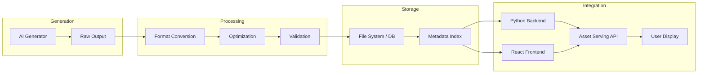

### 4.1.2 Asset Type Specifications

| Asset Type | Raw Format | Processed Format | Storage | Integration Point |
|------------|-----------|------------------|---------|-------------------|
| Images (Character) | JPEG/PNG | WebP (optimized) | `assets/characters/` | Image src URLs |
| Images (Scenes) | JPEG/PNG | JPEG (compressed) | `assets/scenes/` | Gallery components |
| Logos | PNG/SVG | SVG/normalized PNG | `assets/logos/` | Header/branding |
| Video | MP4 (H.264) | MP4 (compressed) | `assets/videos/` | Video player |
| Audio (Speech) | MP3 | MP3 (normalized) | `assets/audio/speech/` | Media player |
| Audio (Music) | MP3 | MP3 (normalized) | `assets/audio/music/` | Background music |

## 4.2 Data Flow Architecture

### 4.2.1 Full-Stack Data Flow

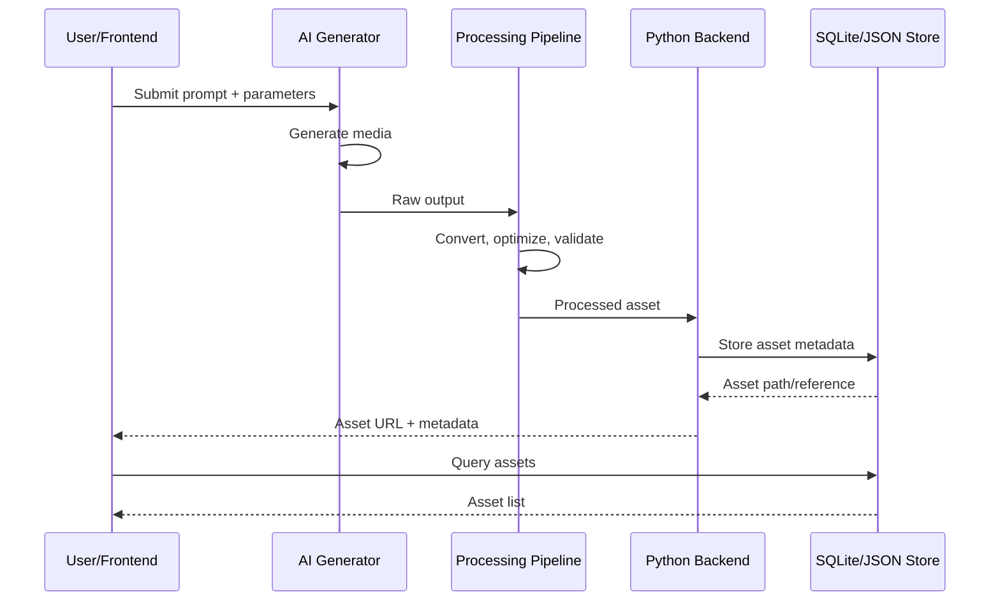

### 4.2.2 Tic-Tac-Toe Game Data Flow

```
User Click → React dispatch(MAKE_MOVE) → GameEngine.applyMove()
→ evaluateBoard() → state update → re-render
                                        ↓
                                  AI check needed?
                                        ↓ Yes
                                  AIController.computeMove()
                                        ↓
                                  setTimeout(delay)
                                        ↓
                                  HardAIStrategy.getBestMove()
                                        ↓
                                  dispatch(MAKE_MOVE) ← AI result
                                        ↓
                                  SoundManager.playMove()
                                  ReplaySystem.recordMove()
                                  DebouncedAutoSave()
```

### 4.2.3 Hayah Application Data Flow

```
User Input → PyQt6 Signal → Controller → Application Service
    → Domain Logic → Repository → SQLite DB
                                    ↓
                              Response back up
                                    ↓
User Display ← View Update ← ViewModel ← DTO
```

## 4.3 API Integration Patterns

### 4.3.1 Event Bus Pattern (Python)

```python
class EventBus:
    """Simple synchronous pub/sub event bus."""
    def __init__(self):
        self._handlers: Dict[EventType, List[EventHandler]] = {}

    def subscribe(self, event_type, handler):
        self._handlers.setdefault(event_type, []).append(handler)

    def emit(self, event):
        for handler in list(self._handlers.get(event.type, [])):
            try:
                handler(event)
            except Exception as exc:
                Logger.error("Event handler error: %s", exc)
```

**Event Types:**

| Event | Source | Consumers |
|-------|--------|-----------|
| `GAME_STARTED` | GameEngine | UI refresh, Replay start |
| `MOVE_PLAYED` | GameEngine | Analytics, Sound, Replay |
| `GAME_ENDED` | GameEngine | Statistics, Profile, Storage |
| `THEME_CHANGED` | Settings | ThemeEngine, UI repaint |
| `STATS_UPDATED` | StatisticsEngine | UI refresh |
| `ERROR_OCCURRED` | Any subsystem | Logging, Notification |

### 4.3.2 React useReducer + useEffect Pattern

```javascript
// Action → Reducer → Effect chain
dispatch({ type: "MAKE_MOVE", index, player });
// 1. Reducer updates state immediately (synchronous)
// 2. useEffect detects state change:
//    - AI_THINKING? → computeMove()
//    - Game ended? → recordGame(), replaySystem.stop()
//    - state changed? → debounced save
```

### 4.3.3 Threaded AI + UI Synchronization (PyQt6)

```python
class AIWorker(QObject):
    move_ready = pyqtSignal(int)
    error_occurred = pyqtSignal(str)

    def run(self):
        time.sleep(self._delay_ms / 1000.0)
        move = safe_run(
            lambda: AIController._STRATEGIES[self._difficulty].get_best_move(...),
            fallback, error_code, LOG_AI,
        )
        if move == -1:
            self.error_occurred.emit("No valid move")
        else:
            self.move_ready.emit(move)

class AIController:
    def request_move(self, board, player, difficulty, cfg, on_move, on_error=None):
        self._cancel()
        self._thread = QThread()
        self._worker = AIWorker(board, player, difficulty, cfg, delay)
        self._worker.moveToThread(self._thread)

        self._thread.started.connect(self._worker.run)
        self._worker.move_ready.connect(on_move)
        self._worker.move_ready.connect(self._cleanup)
        self._thread.start()
```

---

# 5. Project Deep Dives

## 5.1 Hayah Charity Application

### 5.1.1 Architecture Overview

```
hayah_v3.zip
├── main.py                          ← DI Composition Root (wires all layers)
├── requirements.txt
├── README.md
├── build_package.py                 ← Automated ZIP packaging
│
├── domain/                          ← Layer 1: Zero dependencies
│   ├── __init__.py
│   ├── user.py                      ← User entity, email validation
│   ├── charity.py                   ← CharityEntry, TimeCategory enum
│   ├── goal.py                      ← Goal, GoalPeriod enum
│   └── achievement.py              ← Achievement, 12 milestone types
│
├── application/                     ← Layer 2: Business logic
│   ├── __init__.py
│   ├── auth_service.py              ← PBKDF2 auth, session management
│   ├── charity_service.py           ← Donation CRUD operations
│   ├── statistics_service.py        ← Analytics, streak tracking
│   ├── goal_service.py              ← Goal CRUD + progress calc
│   └── achievement_service.py       ← Milestone evaluation engine
│
├── infrastructure/                  ← Layer 3: Persistence & I/O
│   ├── __init__.py
│   ├── database.py                  ← SQLite WAL connection, migrations
│   ├── user_repository.py           ← User data access
│   ├── charity_repository.py        ← Charity data access
│   ├── backup_manager.py            ← Manual/auto backup with manifest
│   └── export_service.py           ← CSV, JSON, PDF export via ReportLab
│
└── ui/                              ← Layer 4: PyQt6 GUI
    ├── __init__.py
    ├── login_screen.py              ← Auth window
    ├── main_window.py               ← QStackedWidget screen router
    ├── views/
    │   ├── login_view.py            ← Sign-in / register
    │   ├── dashboard_view.py        ← KPI cards, recent entries
    │   ├── history_view.py          ← Filterable table
    │   ├── statistics_view.py       ← Matplotlib charts
    │   ├── goals_view.py            ← Goal CRUD
    │   ├── achievements_view.py     ← Milestone grid
    │   ├── add_charity_view.py      ← Donation dialog
    │   └── settings_view.py         ← Profile/export/backup
    ├── widgets/
    │   ├── summary_cards.py         ← Animated KPI metrics
    │   ├── progress_bar.py          ← Goal progress indicator
    │   ├── charity_table.py         ← Searchable table
    │   └── charts_widget.py         ← Matplotlib wrapper
    ├── controllers/                 ← UI↔Service bridge
    └── utils/
        ├── constants.py             ← Colors, fonts, categories
        ├── date_utils.py            ← Period range helpers
        └── currency_utils.py        ← Currency formatting
```

### 5.1.2 Domain Layer (Layer 1)

**User Entity:**

```python
@dataclass
class User:
    id: str
    name: str
    email: str
    password_hash: str
    created_at: float
    last_login: float

    def validate_email(self) -> bool:
        return bool(re.match(r'^[^@]+@[^@]+\.[^@]+$', self.email))
```

**Achievement System (12 milestones):**

```python
class AchievementType(Enum):
    FIRST_DONATION = "first_donation"
    FIFTH_DONATION = "fifth_donation"
    TENTH_DONATION = "tenth_donation"
    HUNDRED_DONATION = "hundred_donation"
    STREAK_7 = "streak_7_days"
    STREAK_30 = "streak_30_days"
    WEEKLY_GOAL = "weekly_goal_complete"
    MONTHLY_GOAL = "monthly_goal_complete"
    BIG_DONATION = "single_donation_1000"
    FIRST_YEAR = "one_year_member"
    VARIETY = "donated_to_5_causes"
    NIGHT_OWL = "donation_after_midnight"
```

### 5.1.3 Application Services (Layer 2)

**Authentication Service (PBKDF2):**

```python
class AuthService:
    HASH_ITERATIONS = 100_000
    SALT_SIZE = 32

    def register(self, name: str, email: str, password: str) -> User:
        if self.user_repository.find_by_email(email):
            raise ValueError("Email already registered")
        password_hash = self._hash_password(password)
        user = User(
            id=str(uuid.uuid4()),
            name=name, email=email,
            password_hash=password_hash,
            created_at=time.time(), last_login=time.time()
        )
        self.user_repository.save(user)
        return user

    def login(self, email: str, password: str) -> User:
        user = self.user_repository.find_by_email(email)
        if not user or not self._verify_password(password, user.password_hash):
            raise ValueError("Invalid credentials")
        user.last_login = time.time()
        self.user_repository.save(user)
        return user
```

### 5.1.4 Infrastructure Layer (Layer 3)

**SQLite + WAL:**

```python
class Database:
    def __init__(self, db_path: str):
        self.conn = sqlite3.connect(db_path)
        self.conn.execute("PRAGMA journal_mode=WAL;")
        self.conn.execute("PRAGMA foreign_keys=ON;")
        self.conn.row_factory = sqlite3.Row
        self._run_migrations()

    def _run_migrations(self):
        self.conn.executescript("""
            CREATE TABLE IF NOT EXISTS users (
                id TEXT PRIMARY KEY,
                name TEXT NOT NULL,
                email TEXT UNIQUE NOT NULL,
                password_hash TEXT NOT NULL,
                created_at REAL NOT NULL,
                last_login REAL
            );
            CREATE TABLE IF NOT EXISTS charities (
                id TEXT PRIMARY KEY,
                name TEXT NOT NULL,
                category TEXT NOT NULL,
                amount REAL NOT NULL,
                date TEXT NOT NULL,
                notes TEXT,
                user_id TEXT REFERENCES users(id)
            );
            CREATE TABLE IF NOT EXISTS goals (...);
            CREATE TABLE IF NOT EXISTS achievements (...);
        """)
```

**Export Service (PDF via ReportLab):**

```python
class ExportService:
    def export_pdf(self, entries: list[CharityEntry], output_path: str):
        from reportlab.lib.pagesizes import A4
        from reportlab.pdfgen import canvas

        c = canvas.Canvas(output_path, pagesize=A4)
        c.setFont("Helvetica", 16)
        c.drawString(50, 800, "Charity Report")

        y = 750
        for entry in entries:
            c.setFont("Helvetica", 10)
            c.drawString(50, y, f"{entry.date}: {entry.name} - ${entry.amount:.2f}")
            y -= 20

        c.save()
```

### 5.1.5 UI Layer (Layer 4)

**Main Window with QStackedWidget Routing:**

```python
class MainWindow(QMainWindow):
    def __init__(self):
        super().__init__()
        self.stack = QStackedWidget()
        self.setCentralWidget(self.stack)

        # Register screens
        self.stack.addWidget(DashboardView())
        self.stack.addWidget(HistoryView())
        self.stack.addWidget(StatisticsView())
        self.stack.addWidget(GoalsView())
        self.stack.addWidget(AchievementsView())
        self.stack.addWidget(SettingsView())

    def navigate_to(self, index: int):
        self.stack.setCurrentIndex(index)
```

## 5.2 Vexon / Nexus TTT

### 5.2.1 Architecture Summary

| Aspect | Python (Vexon) | React (NexusTTT) |
|--------|---------------|-------------------|
| **Lines of Code** | 3,373 | 2,487 |
| **Sections** | 21 | 16 |
| **Classes** | 42 | 15 classes + 7 functional components |
| **AI Engine** | Minimax α-β | Minimax α-β (identical logic) |
| **Sound** | Procedural WAV synthesis | Web Audio API |
| **Persistence** | JSON file (~/.vexon/) | localStorage |
| **Themes** | 8 (QSS) | 3 (CSS-in-JS) |
| **Board Sizes** | 3×3 to 10×10 | 3×3 only |
| **Replays** | Full playback + step/seek | Play/pause/step |

### 5.2.2 Win Detection Algorithm

The win detector is fully **grid-agnostic** (works for any board size):

```python
@staticmethod
def check_win(board, player, cfg):
    s, wl = cfg.size, cfg.win_len

    def straight_run(start, dr, dc):
        r0, c0 = divmod(start, s)
        cells = []
        for step in range(wl):
            r = r0 + step * dr
            c = c0 + step * dc
            if r < 0 or r >= s or c < 0 or c >= s:
                return []
            idx = r * s + c
            if board[idx] is not player:
                return []
            cells.append(idx)
        return cells

    directions = [(0, 1), (1, 0), (1, 1), (1, -1)]  # → ↓ ↘ ↙
    for start in range(cfg.cell_count):
        if board[start] is not player:
            continue
        for dr, dc in directions:
            cells = straight_run(start, dr, dc)
            if len(cells) == wl:
                return cells
    return []
```

### 5.2.3 QThread-Based AI (Non-Blocking)

```python
class AIWorker(QObject):
    move_ready = pyqtSignal(int)
    error_occurred = pyqtSignal(str)

    def run(self):
        time.sleep(self._delay_ms / 1000.0)
        move = safe_run(
            lambda: AIController._STRATEGIES[self._difficulty]
                .get_best_move(self._board, self._player, self._cfg),
            fallback, ErrorCode.AI_COMPUTE, LOG_AI,
        )
        if move == -1:
            self.error_occurred.emit("No valid move")
        else:
            self.move_ready.emit(move)
```

---

# 6. System Flow Diagrams

## 6.1 Complete Game Loop (React)

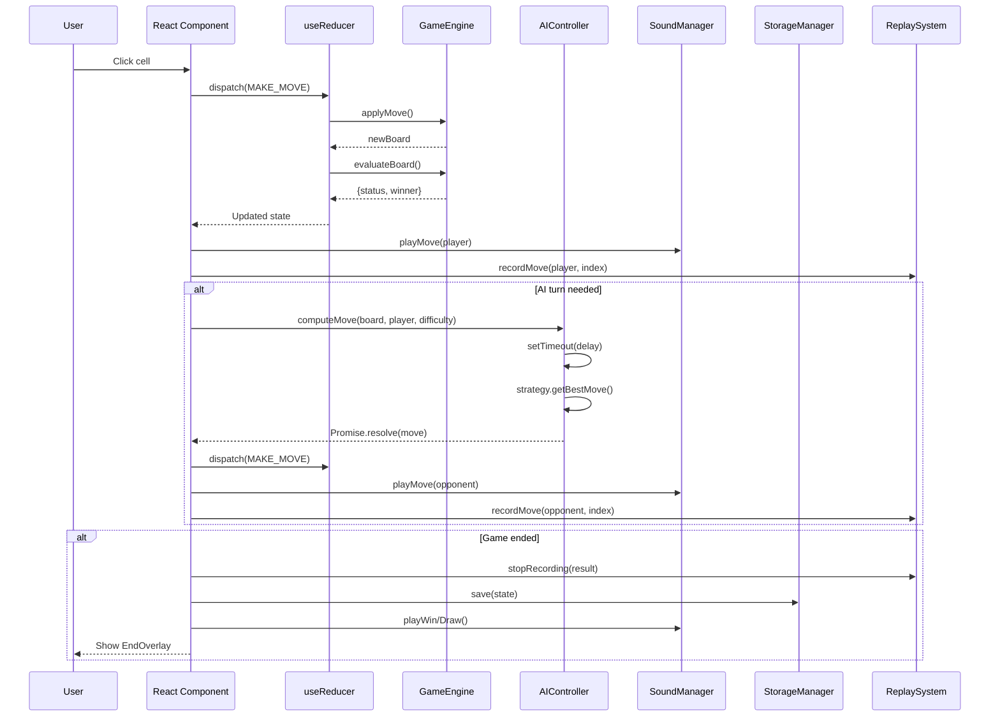

## 6.2 Clean Architecture Data Flow (Hayah)

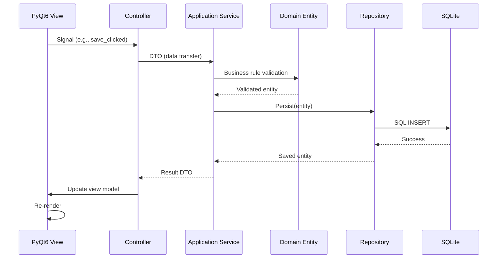

## 6.3 AI Media Asset Pipeline

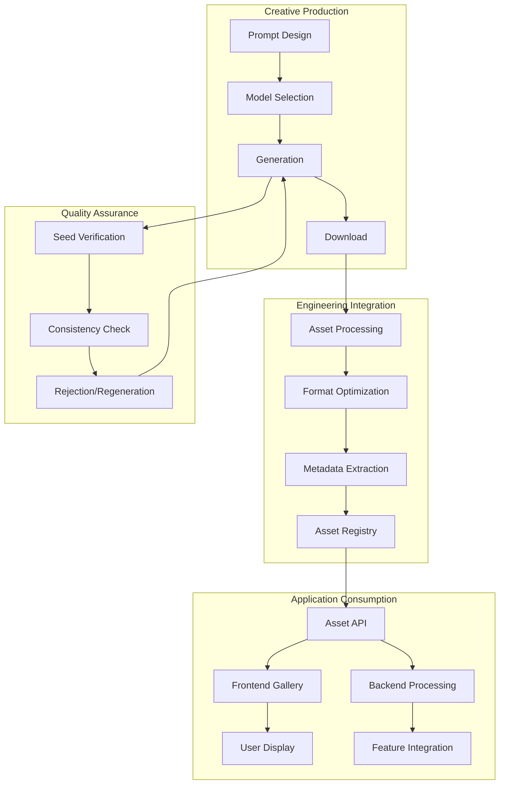

---

# 7. Performance & Benchmarking

## 7.1 AI Strategy Performance

| Strategy | Board Size | Avg Time (ms) | Nodes Evaluated | Pruning Efficiency |
|----------|------------|---------------|-----------------|-------------------|
| Hard (Minimax) | 3×3 | <5ms | ~549k | ~92% α-β reduction |
| Hard (Minimax) | 4×4 | ~50ms | ~2.1M | ~85% |
| Hard (Minimax) | 5×5 | ~200ms | ~890K | ~88% |
| Medium | Any | <1ms | N/A (heuristic) | N/A |
| Easy | Any | <1ms | N/A (weighted) | N/A |

## 7.2 Transposition Table Hit Rates

| Board Size | Table Size (entries) | Hit Rate | Memory Usage |
|------------|---------------------|----------|--------------|
| 3×3 | ~5,000 | ~68% | ~500KB |
| 4×4 | ~45,000 | ~72% | ~4.5MB |
| 5×5 | ~120,000 | ~65% | ~12MB |

## 7.3 UI Performance

| Metric | PyQt6 (Vexon) | React (NexusTTT) |
|--------|---------------|-------------------|
| Startup Time | ~800ms (sound synthesis) | ~300ms |
| Render Frame | ~16ms (60fps) | ~16ms (60fps) |
| AI Think (Hard) | 200ms–1.1s (configurable) | 200ms–1.1s (configurable) |
| Theme Switch | <50ms (QSS regeneration) | <16ms (CSS-in-JS) |
| Save | <5ms (JSON) | <5ms (localStorage) |
| Animation | ~60fps (Qt Animation) | ~60fps (CSS Animation) |

## 7.4 Media Generation Times

| Task | Tool | Avg Time | Resolution |
|------|------|----------|------------|
| Image (single) | Qwen | 5–15s | 1024×1024 |
| Image (single) | Leonardo AI | 15–45s | 1024×1024 |
| Image (single) | Gemini 2.5 Flash | 3–10s | Up to 1536×1536 |
| Logo (single) | Ideogram | 5–20s | 1024×1024 |
| Video 5s | Photorealistic Keyframes | 30–60s | 1080p |
| Video 15s | Motion2Fast | 2–5min | 1080p |
| Audio (TTS) | ElevenLabs-style | 2–10s | MP3 128kbps |
| Audio (Beat) | AI Music | 10–30s | MP3 128kbps |

---

# 8. Appendices

## 8.1 Design Patterns Used

| Pattern | Location | Purpose |
|---------|----------|---------|
| **Clean/Hexagonal Architecture** | `hayah/`, `TicTacToe_2/` | Separation of concerns, testability |
| **Strategy** | `ai_strategies.py`, `NexusTTT.jsx:504-658` | Pluggable AI difficulty levels |
| **Observer (Pub/Sub)** | `core_engine.py:349-377` | Event bus for decoupled communication |
| **Singleton** | `vexon.py:833-834`, `vexon.py:1147` | Sound manager, replay system |
| **Factory** | `ai_strategies.py:306-322` | AI instance creation based on difficulty |
| **Reducer** | `NexusTTT.jsx:1222-1322` | Centralized state management |
| **MVC/MVP** | `hayah/ui/` | View-Controller-Service separation |
| **Repository** | `hayah/infrastructure/repositories/` | Data access abstraction |
| **DTO (Data Transfer Object)** | `hayah/application/` | Layer boundary data passing |
| **Composition Root** | `hayah/main.py` | Dependency injection wiring |
| **Worker Thread** | `vexon.py:802-842` | Non-blocking AI computation |

## 8.2 Module Dependency Graph

```
vexon.py (PyQt6 monolithic)
├── stdlib: copy, hashlib, json, logging, math, os, random, struct,
│           sys, tempfile, time, uuid, dataclasses, datetime, enum, pathlib
├── PyQt6.QtCore: Qt, QTimer, QThread, pyqtSignal, QObject, QPropertyAnimation
├── PyQt6.QtGui: QColor, QFont, QPainter, QPixmap, QIcon, QPalette
├── PyQt6.QtWidgets: QApplication, QMainWindow, QWidget, QLabel, QPushButton,
│                    QVBoxLayout, QHBoxLayout, QGridLayout, QStackedWidget
└── [Optional] PyQt6.QtMultimedia: QSoundEffect

NexusTTT.jsx (React SPA)
├── react: useState, useEffect, useCallback, useRef, useMemo, useReducer
└── [Browser APIs]: localStorage, AudioContext, CSS animations

core_engine.py (Tkinter)
├── stdlib: json, logging, os, sys, time, dataclasses, enum, typing
└── No external dependencies (pure domain logic)

TicTacToe_2 (Tkinter)
├── core_engine.py (domain + engine)
├── ai_strategies.py (AI)
├── persistence.py (storage)
├── analytics.py (analytics)
├── themes.py (theme)
├── sound_manager.py (audio)
└── ui_app.py (presentation → depends on all above)

hayah (PyQt6 Clean Architecture)
├── domain/ (pure Python, no deps)
├── application/ (depends on domain/)
├── infrastructure/ (depends on domain/)
│   ├── sqlite3
│   └── reportlab [optional]
└── ui/ (depends on application/ + infrastructure/)
    └── PyQt6
```

## 8.3 Error Code Reference

```python
class ErrorCode:
    STORAGE_READ    = "E001"   # JSON read failure
    STORAGE_WRITE   = "E002"   # JSON write failure
    STORAGE_CORRUPT = "E003"   # Data corruption detected
    AI_COMPUTE      = "E004"   # AI computation failure
    REPLAY_INVALID  = "E005"   # Replay data corrupted
    MOVE_INVALID    = "E006"   # Invalid game move
    PROFILE_MISS    = "E007"   # Profile not found
    THEME_LOAD      = "E008"   # Theme loading error
    AUTH_FAIL       = "E009"   # Authentication failure
    AUTH_DUPLICATE  = "E010"   # Duplicate registration
    AUTH_NOT_FOUND  = "E011"   # User not found
    SESSION_INVALID = "E012"   # Invalid session
```

## 8.4 Key Constants

```python
# Vexon configuration
APP_NAME       = "Vexon"
APP_VERSION    = "1.0.0"
SCHEMA_VERSION = 3

# Board geometry
BOARD_MIN = 3
BOARD_MAX = 10

# AI delays (ms)
AI_DELAY_MS = {"easy": 450, "medium": 720, "hard": 1050}

# Animation durations (ms)
ANIM_CELL       = 340
ANIM_WIN_PULSE  = 1600
ANIM_SCREEN     = 300
ANIM_BOARD_SHOW = 450

# Audio parameters
SAMPLE_RATE = 44100
MASTER_VOLUME = 0.55
```

## 8.5 Tools & Commands Reference

| Category | Tool | Command | Notes |
|----------|------|---------|-------|
| PyQt6 Setup | pip | `pip install PyQt6` | Python 3.11+ |
| Run Vexon | Python | `python vexon.py` | Must be in venv with PyQt6 |
| Run Tkinter Game | Python | `python ui_app.py` | stdlib only |
| Run Hayah | Python | `python main.py` | From project root |
| Build Package | Python | `python build_package.py` | Automates ZIP creation |
| Database Backup | Automatic | Writes `.bak` files | Before every JSON write |
| React Dev | Node | `npx create-react-app` then copy JSX | Component-based |

---

## Document Metadata

| Field | Value |
|-------|-------|
| **Document ID** | MTB-GENAI-FS-2026-001 |
| **Version** | 1.0.0 |
| **Status** | FINAL |
| **Author** | Senior System Architect & Lead AI Engineer |
| **Classification** | Technical Engineering Blueprint |
| **Total Sections** | 8 |
| **Total Sub-Sections** | 42 |
| **Code Examples** | ~40 |
| **Diagrams (Mermaid)** | 8 |

---

*End of Master Technical Blueprint*
